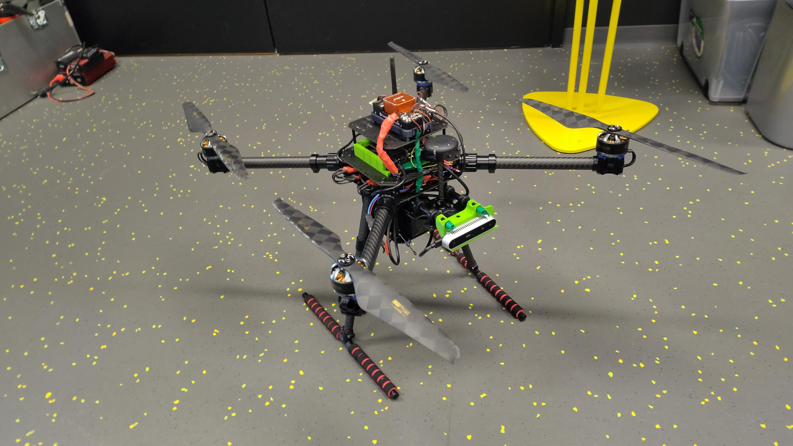

# Samy Warnants Drone Project 008
This project develops a modular UAV with AI-based obstacle avoidance using a companion computer and depth camera. The drone supports manual flight and basic AI perception, forming a foundation for future fully autonomous operation and research applications. On this repo are all the files needed to continue working on this project models for future advancements or simply print ready files to reprint parts that could have possibly been broken. On the repo is also a fully made manual for flight with the drone as it was setup inside my time in Finland (09/02/2026 - 31/05/2026). The folder structure is fairly self explanatory most important files are located inside dedicated folders. Thank you for my amazing time here and allowing me to work on my project (Thesis will be added here too once it is completed!), feel free to reach out should there be any questions regarding the project!

